.. _`Use XSTAF`:

=========================
Use XSTAF
=========================

:Page Status: Development
:Last Reviewed: 

Prepare XSTAF environment
==========================

Prepare XSTAF server
--------------------------

1. Install `STAF <http://sourceforge.net/projects/staf/>`_
2. Install `XSTAF <https://github.com/xcgspring/XSTAF/releases>`_
 * For windows, you can download and use `binary app <https://github.com/xcgspring/XSTAF/releases>`_
 * For other system, ``pip install XSTAF``
 
Prepare XSTAF DUTs
--------------------------

1. Install `STAF <http://sourceforge.net/projects/staf/>`_
2. Set proper trust level, add one line ``trust default level 5`` in STAF config file ``STAF_dir/bin/staf.cfg``

XSTAF UI preview
======================

Server view
------------

XSTAF has one server view per instance, server view is used to:

* manage workspace, new/load/save workspace
* manage DUTs for each workspace, add/delete DUT
* settings
* manage tools, like report generator, test suite generator
* start STAF, check all DUTs status via STAF

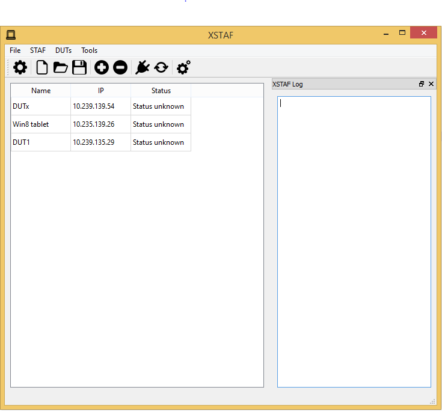

DUT view
---------

XSTAF could have multiple DUT views per instance, DUT view is used to:

* manage test suites for each DUT, add/delete test suite
* run test case, run individual test case/run a whole test suite/rerun fail cases

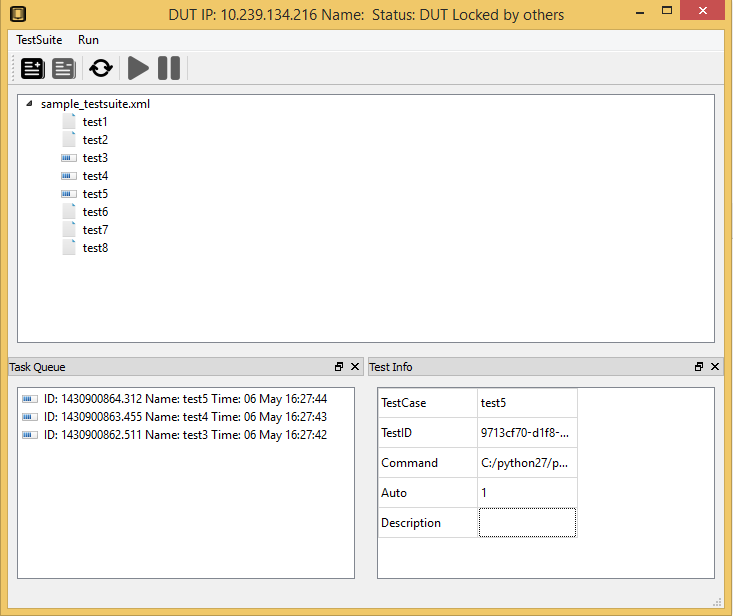

Use XSTAF step by step
======================

settings
----------------------

There are some setting you can set for your test environment

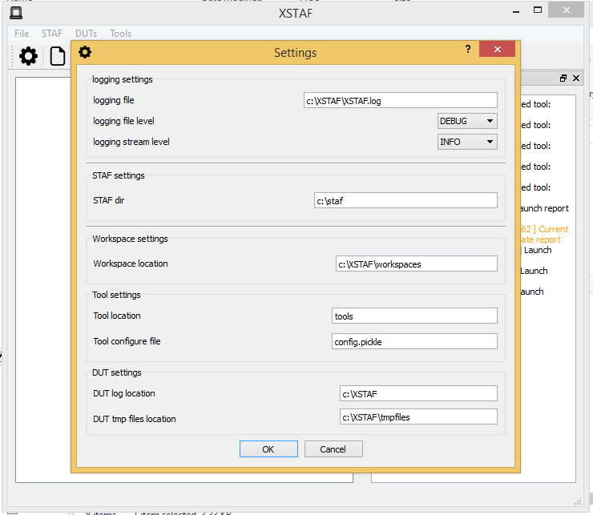
   
new or load existing workspace
-------------------------------

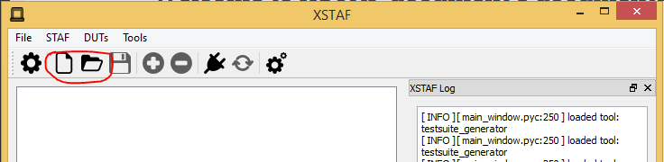

add DUTs
----------------------

After you have new or load a workspace, you can add/delete DUTs into this workspace

.. note::

 When adding DUT, DUT ip is required, DUT name is optional

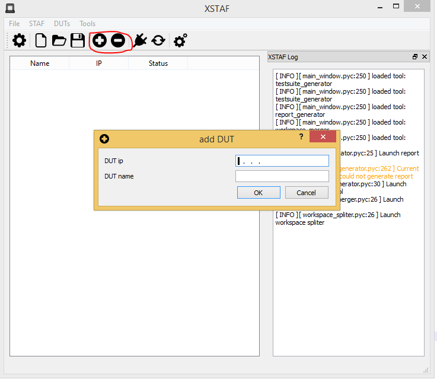

add test suites for each DUT
----------------------------

.. note::

 Double click/right click DUT raw, can open DUT view. On DUT view you can add/delete test suite.

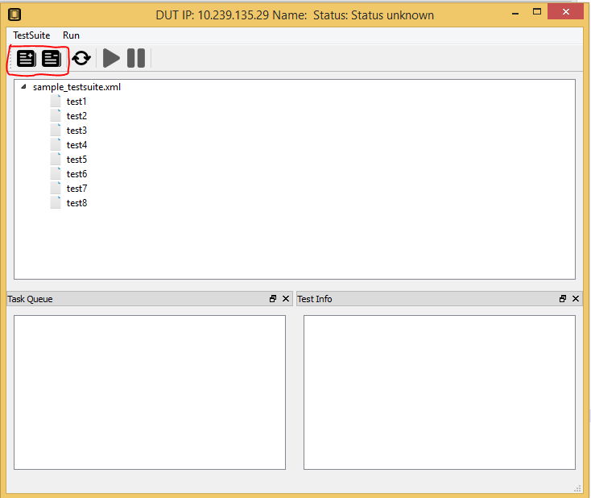

add test case to DUT task queue
--------------------------------

Each DUT has a task queue, tasks in task queue will be run on DUT one by one when task queue started.

.. note::

 Right click at the test suite or test case, you can add test suite or test case to task queue
 
 You can add same test suite/test case to task queue multiple times, then these test suite/test case will be run multiple times
 
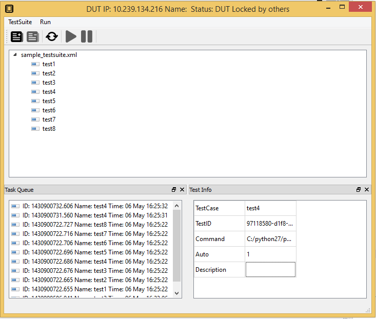
   
start STAF
----------------------------

You can manage DUTs and test suites in workspace without enabling STAF, but if you want to execute test case on DUT, then you need to start STAF

You can start STAF by using STAF launcher, like ``startSTAFProc.bat`` on windows. Or you can use XSTAF to start STAF

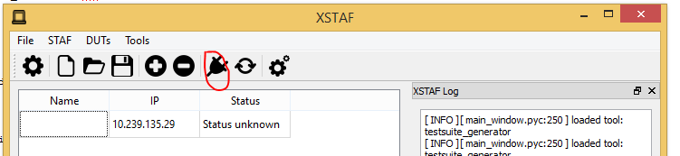

Check DUT status
----------------------------

After start STAF, you can check DUTs status

.. Note::

 If you start STAF not via XSTAF, you must check status in server view before run task
 
.. Note::

 Check status take longer time if you have a lot of DUTs in your workspace, to check specified DUT status, you can check status in DUT view
 
 Check status take longer time if the DUT is not detected.

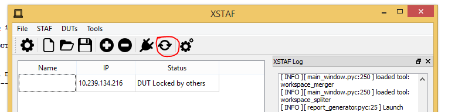

start task queue
--------------------------------

If you DUT status is normal, then you can start task queue of this DUT, test cases in task queue will run synchronously.

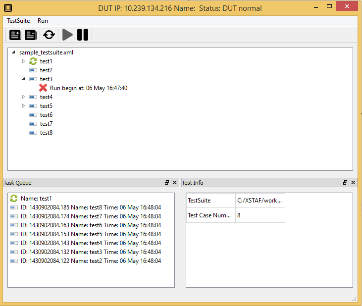

generate test report
--------------------------------

XSTAF has a built-in test report tool, to generate html report for one workspace.
You can just use this test report tool, or write a your own customized report tool.

XSTAF Trouble shooting 
=========================

XSTAF could have bugs since it's a new tool, not have been used and test thoroughly.

XSTAF logger
----------------------

XSTAF provide a logger, with it you can see what is happening inside the XSTAF when bug happens.
If you are a python developer, you maybe can fix it yourself and push the fix to github. Or you can just report a bug to me.

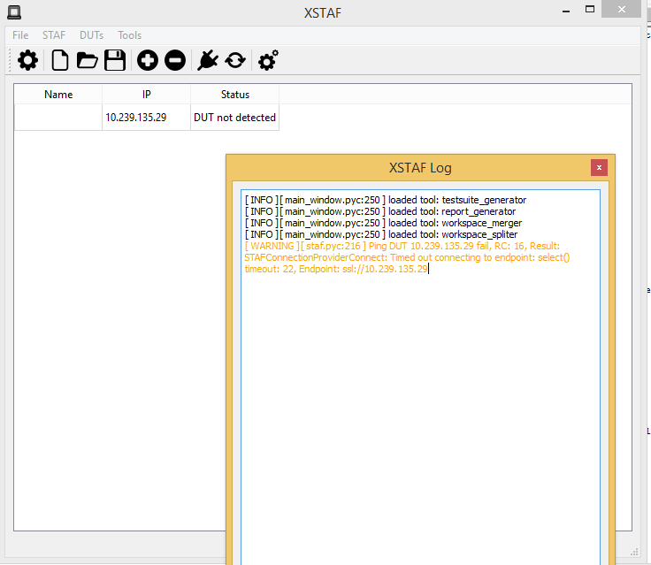

