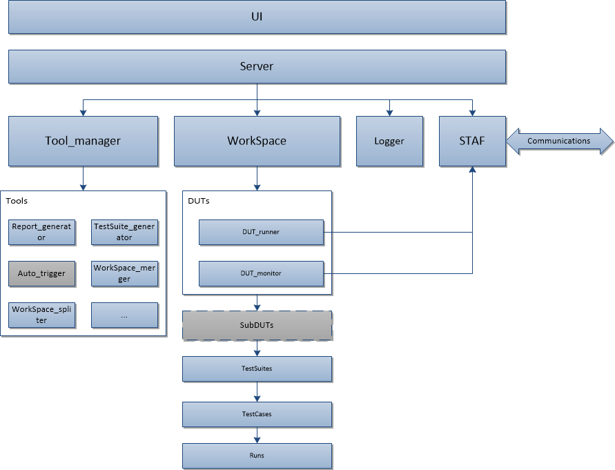
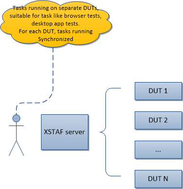
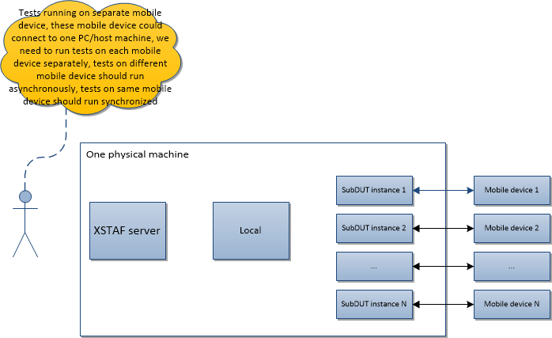
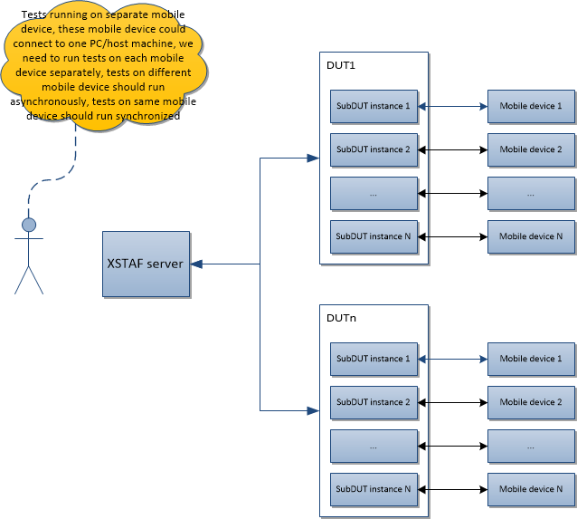

.. _`XSTAF introduce`:

=========================
XSTAF introduce
=========================

:Page Status: Development
:Last Reviewed: 

XSTAF is an execution framework providing a bunch of features for testers' convenience:

- XSTAF is a disturbed execution framework based on `STAF project <http://staf.sourceforge.net/>`_, XSTAF can connect and run tests on multiple DUTs at same time
- XSTAF provide test case management, and testers can have detail controls, down to atomic testcases
- XSTAF provide a tool plugin mechanism, runtime data is exposed so user can develop plugins to control XSTAF runtime data
- XSTAF provide some basic tools, like test report generator, test suite generator to handle common met tasks

XSTAF's competition is other test manage and execution frameworks, like robot, spoon, testNG, or other test back-end of CI system.

XSTAF top view
========================

Below image give an overview of XSTAF modules.

XSTAF use scenarios
========================

This chapter gives a preview of typical use scenarios XSTAF designed for::

PC like DUTs 
------------------------

Browser tests, desktop app tests, and PC function tests are always running on DUTs just like PC. 
STAF normally provides support for these platform, and these platform are power enough to support some extra tasks from STAF.
So usually we deploy scripts, libraries and STAF client to DUTs directly, and use XSTAF to control the DUT directly.

The use scenario for this kind of tests, you can deploy XSTAF just like below:

.. note::

 For PC like DUTs, XSTAF run tests synchronously, which means these is only one test running on one DUT at some time
   
mobile DUTs (not ready yet)
---------------------------

Mobile app tests are running on mobile devices. 
STAF doesn't support mobile device, and for tests on mobile devices, usually we need an extra PC to setup the test environment, like libraries, platform tools(adb).
So XSTAF use a different structure to support tests on mobile devices, like below:

XSTAF server and client running on same machine, with multiple mobile devices

XSTAF server control multiple machines, with multiple mobile devices connect with each machine
   

.. note::

 For mobile tests, XSTAF can run tests asynchronously, but for one subDUT, tests are running synchronously