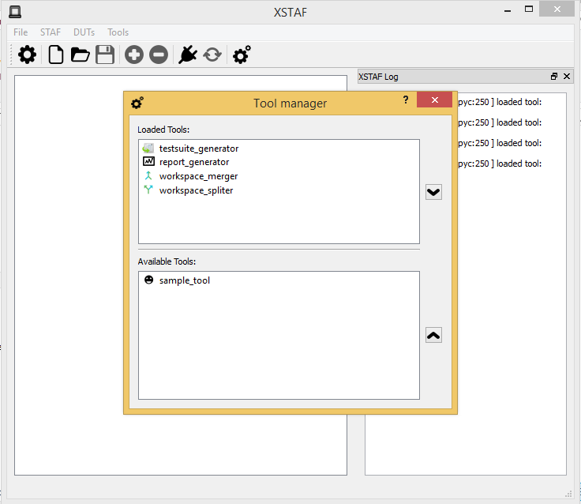

.. _`XSTAF tool management`:

=========================
XSTAF tool management
=========================

:Page Status: Development
:Last Reviewed: 

XSTAF provide a plugin mechanism to support extending XSTAF functions.

Tool manager
========================

Tool manager is response to check the tool directory, and load the tools available.
Tool manager supports load the tool dynamically, and provide tools runtime XSTAF window instance object, so tools can interact with XSTAF core. 

Add custom tools
=========================

To write custom tools, you just need implement an standard interface provided by tool manager, and place your tool to ``tools`` directory.

Below is code from ``tools/sample_tool``, it demonstrates how to implement a sample interface::

    import traceback
    from XSTAF.core.logger import LOGGER
    from PyQt4 import QtCore, QtGui
    from ui.ui_sampleDialog import Ui_SampleDialog
    import ui.resources_rc

    ###############################
    #interface for tool manager
    ###############################
    class Tool(object):
        _description = "Sample Tool"
        main_window = None
        
        #this method is for tool manager to pass in the XSTAF main window runtime object
        #so in this tool, we can interact with XSTAF main window
        @classmethod
        def set_main_window(cls, main_window):
            cls.main_window = main_window
        
        #method for tool manager to get icon of this tool
        @staticmethod
        def icon():
            tool_icon = QtGui.QIcon()
            tool_icon.addPixmap(QtGui.QPixmap(":icons/icons/sample.png"))
            return tool_icon
        
        #method for tool manager to launch this tool's dialog
        @classmethod
        def launch(cls):
            try:
                LOGGER.info("Launch sample tool")
                tool_dialog = SampleTool(cls.main_window)
                tool_dialog.exec_()
            except:
                LOGGER.error(traceback.format_exc())
            
        #method for tool manager to get description of this tool
        @classmethod
        def description(cls):
            return cls._description
        
    ################################
    #dialog class for this tool
    ################################
    class SampleTool(QtGui.QDialog, Ui_SampleDialog):
        def __init__(self, parent):
            QtGui.QDialog.__init__(self)
            self.setupUi(self)  

Built-in Tools
=========================

XSTAF provide some built-in tools for common met test functions.

report_generator
------------------------

report generator can generate a static html report for current workspace.

testsuite_generator
------------------------

test suite generator can generate XSTAF test suite XML file from other format, like a CSV document.

Plan to support formats fro some common used QC system, like testlink...

workspace_merger
------------------------

workspace merger supports merging multiple workspaces to one workspace.

workspace_spliter
------------------------

workspace merger supports splitting one workspace with multiple DUTs into multiple workspaces with one DUT.

