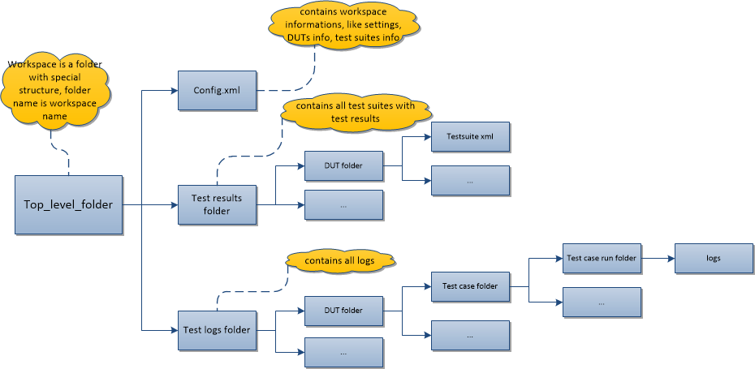

.. _`XSTAF workspace`:

=========================
XSTAF workspace
=========================

:Page Status: Development
:Last Reviewed: 

XSTAF provide a mechanism to store a stand-alone test configuration all together (DUTs, testsuites, test results, test logs...).
The benefit of this mechanism is you can have distinguishing workspace for different configurations, make your test plans clean and clear.

XSTAF workspace overview
=========================  

Currently a workspace is a folder of pre-defined structure, like below:

config.xml
=========================

config.xml is workspace config file, contains informations like DUTs info, testsuites info.
XSTAF load the DUTs and testsuites according to infomations in this config file.

User need not create a config.xml file.
When you new and save a workspace, a config.xml will be auto generated into the workspace folder, containing DUTs and testsuites info in the XSTAF runtime. 

A sample config xml like below::

    <XSTAF>
      <settings>
        <setting name="DefaultWorkspace">.default</setting>
        <setting name="WorkspaceLocation">c:\XSTAF\workspaces</setting>
      </settings>
      <DUTs>
        <DUT ip="10.239.36.123" name="">
          <testsuites>
            <testsuite name="testsuite1.xml" />
          </testsuites>
        </DUT>
        <DUT ip="10.239.36.124" name="">
          <testsuites>
            <testsuite name="testsuite2.xml" />
          </testsuites>
          <testsuites>
            <testsuite name="testsuite3.xml" />
          </testsuites>
        </DUT>
      </DUTs>
    </XSTAF>

test results folder
=========================

test results folder contains testsuites info and test results for each DUT, test suites and test results are stored with a XML file, format like below::

    <TestSuite>
      <TestCases>
        <TestCase>
          <ID>19730170-ced9-11e4-bd02-001b211bc956</ID>
          <Name>test_name</Name>
          <Command>C:/python27/python.exe python_script</Command>
          <Auto>False</Auto>
          <Timeout>6000</Timeout>
          <Description>demo test</Description>
          <Runs>
            <Run>
              <Start>1427087989.969</Start>
              <End>1427087995.672</End>
              <Result>fail</Result>
              <Status />
              <Log>C:\XSTAF\workspaces\workspace_name\test_logs\19730170-ced9-11e4-bd02-001b211bc956\1427087989.969</Log>
            </Run>
          </Runs>
        </TestCase>
      </TestCases>
    </TestSuite>

test logs folder
=========================

test logs folder is used to store test logs for each run of test case.
Logs location is like::

    abs_workspaces_location/workspace_folder/test_logs/Test_ID/start_time

.. note::
    Test logs include stdout/stderr of test scripts and all files in tmp log location.

